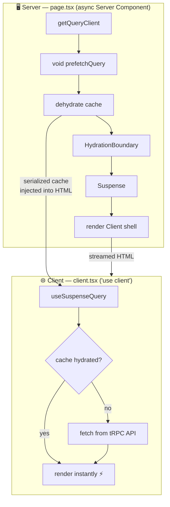

# 🚀 n8n Clone – Workflow Automation Platform

A modern **n8n-inspired workflow automation platform** built with **Next.js**, **TypeScript**, and **Tailwind CSS**. Design, connect, and automate workflows using a visual drag-and-drop editor with AI integrations and real-time execution monitoring.

## 🚀 Quick Start

```bash
# Install dependencies
npm install

# Start the development server at localhost:3000 & run background job worker
npm run dev
npx inngest-cli@latest dev

# Start dev all
npm run dev:all
```

### prisma commands reference:
```bash
# Open Prisma Studio (database GUI)
npx prisma studio

# Generate Prisma client from schema
npx prisma generate

# Create a new migration (without applying it)
npx prisma migrate dev --create-only --name <migration-name>

# Apply pending migrations to the database
npx prisma migrate deploy

# Reset the database and apply all migrations (use with caution)
npx prisma migrate reset

### Run database migrations
npx prisma migrate dev
```

### shadcn/ui commands reference:
```bash
# Generate all shadcn/ui components
npx shadcn@latest add --all

# Generate shadcn/ui components
npx shadcn@latest add <component-name>
```

### better-auth commands reference:
```bash
# generate better-auth postgres adapter
npx auth@latest generate
```


## ✨ Features

- 🔐 **User Authentication** — Secure sign-up, login, and session management
- 💳 **Payment & Subscription Management** — Stripe-powered billing
- ⚡ **Real-time Workflow Execution** — Run and monitor automations live
- 🎨 **Visual Workflow Builder** — Drag-and-drop editor powered by React Flow
- 🤖 **AI Integration** — Connect to OpenAI and Google Gemini
- 📊 **Execution History** — Track and audit every workflow run
- 🌙 **Modern UI** — Clean, accessible components via shadcn/ui
- 📱 **Responsive Design** — Works on desktop and mobile
- 🛡️ **Error Monitoring** — Real-time error tracking with Sentry
- 🤖 **AI Code Review** — Automated PR reviews with CodeRabbit

---

## 🛠️ Tech Stack

### Frontend

| Library | Docs |
|---|---|
| Next.js 15 (App Router) | https://nextjs.org/docs/app/getting-started/installation |
| React 19 | https://reactjs.org/docs/getting-started.html |
| TypeScript | https://www.typescriptlang.org/docs/ |
| Tailwind CSS v4 | https://tailwindcss.com/docs/installation |
| shadcn/ui | https://ui.shadcn.com/docs/installation/next |
| React Flow | https://reactflow.dev/docs/ |
| tRPC | https://trpc.io/docs/client/nextjs/app-router-setup |
| Zod | https://zod.dev/ |
| TanStack Query | https://tanstack.com/query/v4/docs/overview |
| Theme tweakcn | https://tweakcn.com/ |
| Logo | https://logoipsum.com/
| Sentry | https://docs.sentry.io/platforms/javascript/guides/nextjs/ |

### Background job, workflow execution, and event-driven application

| Library | Docs |
|---|---|
| Inngest | https://inngest.com/docs/ |
| mprocs | https://github.com/pvolok/dekit

### Backend

| Library | Docs |
|---|---|
| Next.js Route Handlers | https://nextjs.org/docs/app/building-your-application/routing/route-handlers |
| Prisma ORM | https://www.prisma.io/docs/guides/frameworks/nextjs |
| PostgreSQL (Neon) | https://neon.com/ |

### Authentication

- **Better Auth** — [betterauth.dev](https://www.better-auth.com/) *(or replace with your preferred auth provider)*
- **CLI** — [betterauth.dev/docs/cli](https://better-auth.com/docs/concepts/cli)

### Payments

- **Polar** — [polar.sh](https://polar.sh/)
- **Integrate better auth** — [Polar with better auth](https://polar.sh/docs/integrate/sdk/adapters/better-auth#betterauth)

### AI Providers Gemini

- **Get key** - https://aistudio.google.com/
- **gemini-3.1-pro-preview** — [https://ai-sdk.dev/providers/ai-sdk-providers/google](https://ai-sdk.dev/providers/ai-sdk-providers/google)

### DevOps & Tooling

- **ESLint** — Code linting
- **Prettier** — Code formatting
- **Biome** — Fast linter and formatter
- **Sentry** — Error and performance monitoring
- **CodeRabbit** — AI-powered code review ([coderabbit.ai](https://www.coderabbit.ai/))
- **GitHub Actions** — CI/CD automation *(optional)*

---

## 📦 Getting Started

### 1. Clone the repository

```bash
git clone https://github.com/nhattruongniit/n8n-zapier-clone
cd n8n-zapier-clone
```

### 2. Install dependencies

```bash
npm install
# or
pnpm install
```

### 3. Configure environment variables

Create a `.env` file in the project root and clone the `.env.template` file:

```bash
cp .env.template .env
```

---

## 📂 Project Structure

```text
src/
├── app/              # Next.js App Router pages and layouts
├── components/       # Shared UI components (shadcn/ui + custom)
├── features/         # Feature-based modules (auth, workflows, etc.)
├── hooks/            # Custom React hooks
├── lib/              # Utility libraries and third-party clients
├── server/           # Server-side helpers and tRPC routers
├── services/         # External API service integrations
├── trpc/             # tRPC client, server, and router definitions
├── types/            # Shared TypeScript type definitions
└── utils/            # Pure utility/helper functions

prisma/               # Prisma schema and migration files
public/               # Static assets
```

---

## 🏗️ Data Fetching Architecture (tRPC + TanStack Query)

This project uses a **Server-first prefetch + Client hydration** pattern to get the best of both worlds: fast initial page loads (no loading spinners) and fully interactive client-side components.

### Pattern Overview



### `page.tsx` — Server Component

```ts
// 1. Get a shared QueryClient instance (server-side)
const queryClient = getQueryClient();

// 2. Kick off the data fetch on the server (non-blocking)
void queryClient.prefetchQuery(trpc.getUsers.queryOptions());

// 3. Dehydrate the cache and pass it down to the client
<HydrationBoundary state={dehydrate(queryClient)}>
  <Suspense fallback={<div>Loading...</div>}>
    <Client />
  </Suspense>
</HydrationBoundary>
```

### `client.tsx` — Client Component

```ts
// Reads data from the cache already populated by the server
// Falls back to a live fetch if cache is missing
const { data: users } = useSuspenseQuery(trpc.getUsers.queryOptions());
```

---

### Why `prefetchQuery` (not `await prefetchQuery`)?

`prefetchQuery` returns a **Promise** but you intentionally do **not** `await` it.

| Approach | Behavior |
|---|---|
| `await prefetchQuery(...)` | Blocks rendering until data is ready — defeats streaming |
| `prefetchQuery(...)` (no void) | Floating promise — ESLint `no-floating-promises` error |
| `void prefetchQuery(...)` ✅ | Starts fetch without blocking render, silences ESLint |

Using `void` signals explicitly: *"I intentionally do not await this promise."*
Next.js will stream the shell HTML immediately, and the data arrives before the client hydrates.

---

### Why `useSuspenseQuery` (not `useQuery`)?

| Hook | Behavior |
|---|---|
| `useQuery` | Returns `{ data, isLoading, isError }` — you handle loading/error states manually |
| `useSuspenseQuery` ✅ | Integrates with React `<Suspense>` — throws a Promise if data is not ready, letting `<Suspense fallback>` handle the loading UI automatically |

Because the server already ran `prefetchQuery`, the cache is hydrated by the time `useSuspenseQuery` runs on the client — it resolves instantly with no loading state shown.

---

### Full Request Lifecycle

```
1. Browser requests /page
2. Server: getQueryClient() creates a fresh QueryClient
3. Server: void prefetchQuery() → starts fetching users from DB via tRPC
4. Server: renders HydrationBoundary + Suspense + <Client /> shell → streams HTML
5. Data arrives → stored in QueryClient cache
6. dehydrate(queryClient) serializes cache into the HTML payload
7. Browser: TanStack Query rehydrates the cache from the HTML
8. Client: useSuspenseQuery() reads from cache → renders instantly, no spinner
```

---

## 📄 License

This project is licensed under the [MIT License](LICENSE).
